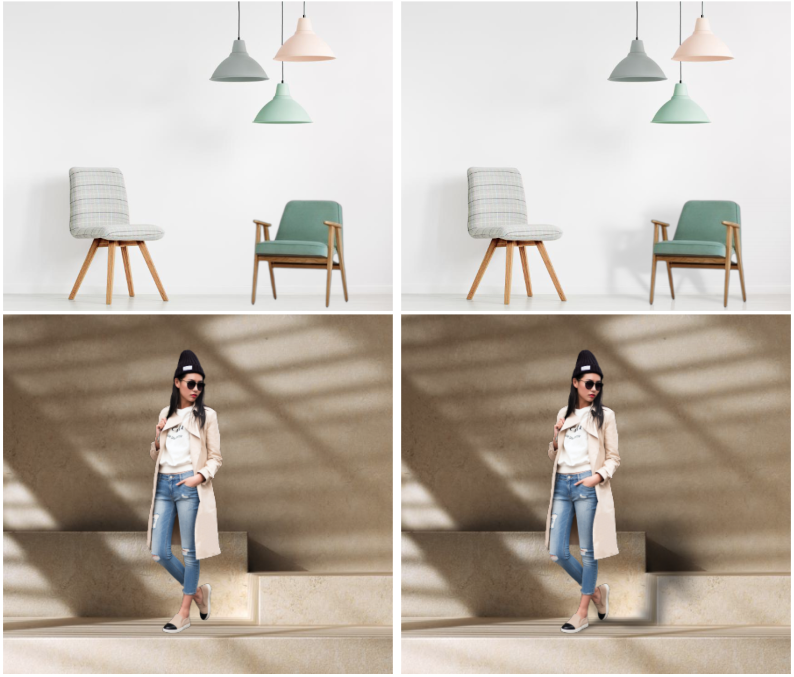

# PixHtLab 
This is the source code([[**Paper**](https://arxiv.org/pdf/2303.00137.pdf)]  [[**SSN Demo**](#ssn-demo)] [[**SSN Training**](#ssn-training)] [[**PixHtLab Demo**](#pixhtlab-demo)] [[**SSG & PixHtLab Training**](#pixhtlab-training)]) repository for three papers:  


* [(CVPR 2023 highlight) PixHt-Lab: Pixel Height Based Light Effect Generation for Image Compositing](https://arxiv.org/pdf/2303.00137.pdf)

<p align="center">
  
</p>
 
* [(ECCV 2022) Controllable Shadow Generation Using Pixel Height Maps](https://arxiv.org/pdf/2207.05385.pdf)

<p align="center">
  
</p>

 
* [(CVPR 2021 oral) SSN: Soft Shadow Network for Image Composition](https://arxiv.org/abs/2007.08211)

<p align="center">
  
</p>

# SSN  
We released the training codes, a gradio demo (also hosted in huggingface) and the training dataset. 

## Dataset 
The training dataset can created by code provided in the SSN [old repo](https://github.com/ShengCN/SSN_SoftShadowNet).

We provide a precomputed dataset composed of 558 different 3D models, which can be downloaded from our huggingface dataset repo. 
See the [**ssn_dataset.hdf5**](https://huggingface.co/datasets/ysheng/SSN-SSG-PixHtLab/resolve/main/SSN/Dataset) file.


## SSN-Demo 
A gradio-based GUI demo is provided in the `Demo/SSN` folder. First, download the [weight](https://huggingface.co/datasets/ysheng/SSN-SSG-PixHtLab/tree/main/SSN/weights) it used.
Then run the following code to see the demo: 
``` bash
python app.py
```

## SSN-Training 
The training codes are under `Train` folder. To reproduce the training process, first prepare the dataset discussed above, then run the following command: 

``` bash 
cd Train 

# before running, try to check the setting in SSN.yaml.
# The YAML file assumes the dataset file path is: Train/Dataset/SSN/ssn_dataset.hdf5
python app/Trainer.py --config configs/SSN.yaml
```

# SSG & PixHtLab
We find shadow can be rendered using pixel height maps. We further explored rendering in pixel height representation and found not only shadow can be rendered, 3D light effects (shadow, reflection, refractions, etc) can be rendered as well. So SSG can be viewed as a subset of PixHtLab. For simplicity, this repo directly release the code for PixHtLab. 

## Environment Setup
First, create a conda environment with python 3.9. 

```bash
conda create -n pixht python=3.9  -y
conda activate pixht
```

Then run the ``env.sh`` script. I noticed that the environment to setup the training framework is becoming to be a little tricky due to some python package updates. So I will build a Docker for the ease of use. 

```bash
bash env.sh 
```

## Dataset 
As the file is large (173G), the dataset file is put in Dropbox. Use this [link](https://www.dropbox.com/scl/fi/ux7wr5uz2rne6vu70eq2f/dataset.hdf5?rlkey=pzubhj41m6j1muj393j33iuzm&dl=0) to download. The advantage of Dropbox link is that you can use wget to download. 

```bash
# remember to cd to where you want to save the dataset file. 
wget -O dataset.hdf5 https://www.dropbox.com/scl/fi/ux7wr5uz2rne6vu70eq2f/dataset.hdf5?rlkey=pzubhj41m6j1muj393j33iuzm&dl=0
```


## PixHtLab-Demo 
For PixHtLab, we do not have Gradio demo as the computation relies on CUDA layer operation. The free Gradio demo on huggingface only provides CPU calculations. 
Instead, I put a jupyter notebook in the ``Demo/PixhtLab/Demo.ipynb``. It provides an example to show how to use PixHtLab to render shadow and reflections. 

### Weight File 
Soft shadow rendering needs pre-trained SSN. The weight can be downloaded from [here](https://www.dropbox.com/scl/fi/7vzb0hlff0wbbb6l6qiyb/human_baseline_all_21-July-04-52-AM.pt?rlkey=lw34u1qao6had58t9vqy3bfbj&dl=0). Create a weight folder (weights) under ``Demo/PixhtLab/`` and put the weight there. Or use the following command to do this: 

```Bash
mkdir Demo/PixhtLab/weights
cd Demo/PixhtLab/weights

# wget to download 
wget -O human_baseline_all_21-July-04-52-AM.pt https://www.dropbox.com/scl/fi/7vzb0hlff0wbbb6l6qiyb/human_baseline_all_21-July-04-52-AM.pt?rlkey=lw34u1qao6had58t9vqy3bfbj&dl=0
```

This demo weight is a little old. But it should be enough for most cases for demonstration. If you want better weight, you can try to replace this weight with the latest SSN [weight](https://huggingface.co/datasets/ysheng/SSN-SSG-PixHtLab/resolve/main/SSN/weights/0000001000.pt?download=true) discussed above. I have not tested if directly replacing the weight is OK. If it is not OK, try to replace the inference module using the above SSN inference module.


## PixHtLab-Training 
The training codes are under `Train` folder. To reproduce the training process, first prepare the dataset discussed above. The dataset for SSG and SSN++ (sometimes I call it GSSN) is the same hdf5 file. Then run the following command: 

``` bash 
cd Train 

# Before running, try to check the setting in SSG.yaml.
# The YAML file assumes the dataset file path is: Train/Dataset/SSG/dataset.hdf5
python app/Trainer.py --config configs/SSG.yaml

# or if you want to train SSN++ with 3D-aware buffer channels, try this:
# The YAML file assumes the dataset file path is: Train/Dataset/SSG/dataset.hdf5
python app/Trainer.py --config configs/GSSN.yaml
```


# Updates
- [x] [2023-03-16] Basic setup. 
- [x] [2024-01-02] SSN dataset/demo/inference/training 
- [x] [2024-02-20] (Sry, I was busy at that time.) SSG/PixhtLab dataset/demo/inference/training 
- [x] [2024-02-20] Python environment setup 
- [ ] Build a docker image 

# License
This code repo can only be used for non-commercial use only. 

# Citation
If you think the code/dataset is useful, please remember to cite the three papers: 
```
@inproceedings{sheng2023pixht,
  title={PixHt-Lab: Pixel Height Based Light Effect Generation for Image Compositing},
  author={Sheng, Yichen and Zhang, Jianming and Philip, Julien and Hold-Geoffroy, Yannick and Sun, Xin and Zhang, He and Ling, Lu and Benes, Bedrich},
  booktitle={Proceedings of the IEEE/CVF Conference on Computer Vision and Pattern Recognition},
  pages={16643--16653},
  year={2023}
}

@inproceedings{sheng2022controllable,
  title={Controllable shadow generation using pixel height maps},
  author={Sheng, Yichen and Liu, Yifan and Zhang, Jianming and Yin, Wei and Oztireli, A Cengiz and Zhang, He and Lin, Zhe and Shechtman, Eli and Benes, Bedrich},
  booktitle={European Conference on Computer Vision},
  pages={240--256},
  year={2022},
  organization={Springer}
}

@inproceedings{sheng2021ssn,
  title={SSN: Soft shadow network for image compositing},
  author={Sheng, Yichen and Zhang, Jianming and Benes, Bedrich},
  booktitle={Proceedings of the IEEE/CVF Conference on Computer Vision and Pattern Recognition},
  pages={4380--4390},
  year={2021}
}
```


